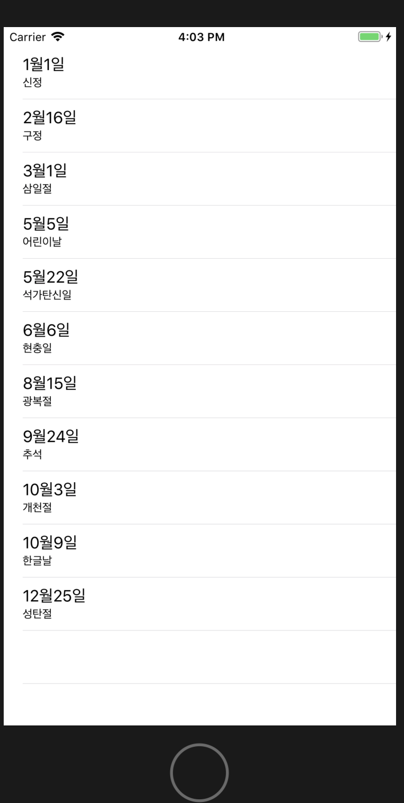
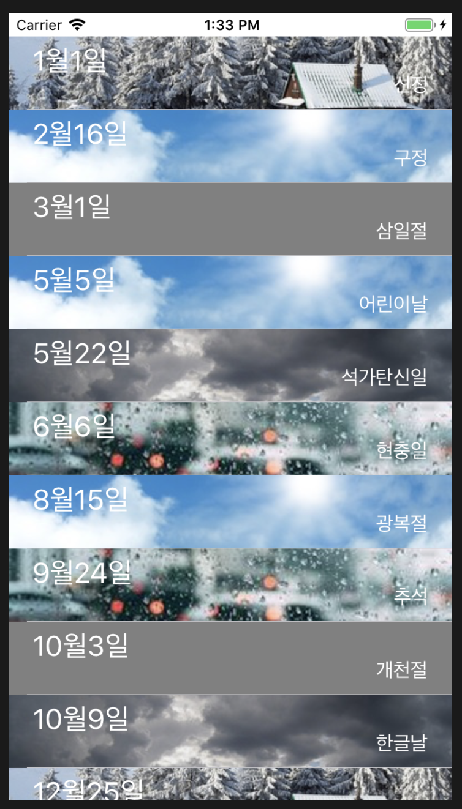

# swift-weatherapp
STEP18 날씨 앱 저장소


## STEP 1


### 결과화면


- TableViewController를 새로 만들지 않고, 기존 UIViewController 내에 TableView를 만들어서 쓴다면, Attributes Inspector에서 Table View의 Contents를 `Static Cells` 로 설정할 때,  xcode 스토리보드 상에서 에러가 발생합니다.
- 하나의 테이블 뷰 섹션에 2개의 셀이 드러가므로 커스텀 테이블뷰 컨트롤러인 `WeatherViewController` 는 아래와 같이 수정해줘야 시뮬레이터 상에서 정상적으로 스토리보드의 커스터마이징 화면이 뜹니다.

```swift
override func numberOfSections(in tableView: UITableView) -> Int {
		// #warning Incomplete implementation, return the number of sections
		return 1
}
override func tableView(_ tableView: UITableView, numberOfRowsInSection section: Int) -> Int {
		// #warning Incomplete implementation, return the number of rows
		return 2
}
```


- [ContentMode 학습 정리](./step1/ImageViewContentMode.md)


## STEP 2


### 결과화면




### 학습정리

- [학습정리내용](./step2/studies_TableViewController_TableView_DataSource.md)


## STEP 3

### 

### 결과화면





#### 학습거리

- 테이블뷰에서 자동으로 결정하는게 아니라 강제로 셀 높이를 지정하는 방법

  - 스토리보드의 Size Inspector에서 Table View Cell의 Row Height를 지정하거나, 
  - 코드 프로그래밍 시에는 tableView의 Cell 컨텐츠를 입히는 **func** **tableView**( _ **tableView**: UITableView, cellForRowAt **indexPath**: IndexPath) -> UITableViewCell  등에서 `tableView.rowHeight` 를 고정값으로 지정하면 됩니다.

- 셀 id별로 재사용하는 방식

  - tableView의 `dequeueReusableCell` 메서드를 활용하여 `withIdentifier:` 값으로 TableViewCell의 Identifier를 집어넣으면 테이블 뷰 렌더링 과정에서 해당 셀을 재사용하는 것이 가능합니다. 
  - 스토리보드에서 셀의 Id값을 지정하였다면 <u>Attribute Inspector의 **Identifier**</u> 에서 설정 및 확인 가능합니다. 

- 재 사용시 유의사항

  - 값을 선택적으로 받는 경우가 존재한다면 셀의 기존 설정값을 지우고 다시 그리는 작업이 필요합니다. 

  - ex) `cell.backgroundView?.clearsContextBeforeDrawing = true` 처럼 기존에 제공되는 api를 통해 새로 그리기 전에 컨텍스트를 비우거나, 값의 유무가 존재하는 데이터에 대해서는 값을 비워줘야 합니다.

  - 혹은 커스텀 셀에 대해 다음과 같이 **prepareForReuse** 메서드를 오버라이드 취하여 잔존값을 비워야 안전하게 재사용가능합니다.

    ```swift
    class HolidayTableViewCell: UITableViewCell {
        @IBOutlet weak var dateLabel: UILabel!
        @IBOutlet weak var subtitleLabel: UILabel!
        override func prepareForReuse() {
            super.prepareForReuse()
            dateLabel.text = nil
            subtitleLabel.text = nil
            self.backgroundView = nil
        }
    }
    ```

    

- 커스텀 셀 사용시 주의사항
  - 반드시 재사용가능한 셀을 담은 큐에 그것이 존재하는지 묻는 과정에서 `unwrapping` 과 ` type casting`이 필요합니다. 
  - cell의 identifier와 cell 클래스 명은 다를 수 있습니다. 
  - 서로 다른 커스텀 셀을 한 테이블의 한 섹션에 나타내기 위해서는 prototype cells의 개수를 조정해야 함


### 참고 

https://medium.com/@stasost/ios-how-to-build-a-table-view-with-multiple-cell-types-2df91a206429

https://stackoverflow.com/questions/30774671/uitableview-with-more-than-one-custom-cells-with-swift