# swift-weatherapp
### Step 1

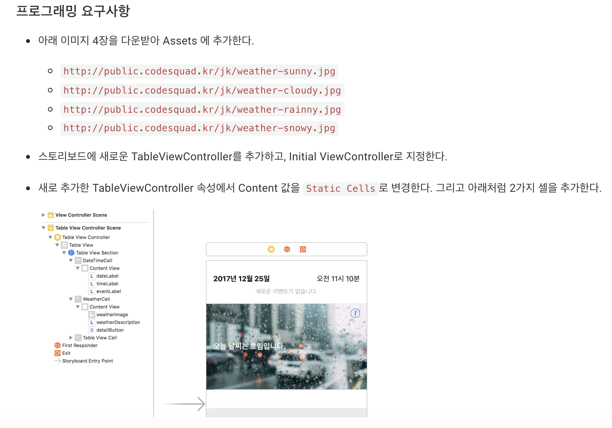

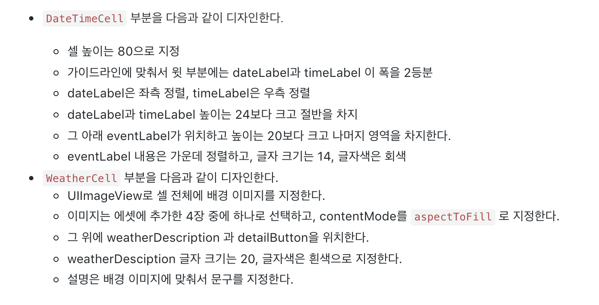

* UITableViewController를 이용해 Static Cell을 디자인한다.
* Date() 타입을 사용한다.


**UITableViewController**

 이번 단계에서는 UITableView의 `Static Cell` 를 이용하여 TableView를 디자인해보았다.

 우선 TableView를 선택하고 다음 그림과 같이 Dynamic, Static Cells 중 Static Cell을 선택하여 준다.

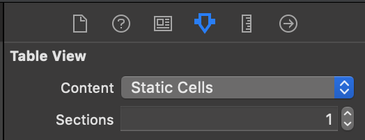


* **Dynamic** : 말 그대로 동적인 테이블 뷰 구현방식이다. 보통 테이블 뷰의 요청에 응답하는 방식으로 표현된다. 코드로 구현한다 보통 DataSource, Delegate 등을 상속받아 구현한다.
* **Static Cells** : `TableViewController`를 이용하는 경우에만 만들 수 있다. 여기에 `Static Cell` 모드를 선택한 후 코드로 구현할 경우 적용되지 않는다. 보통 스토리보드로 작업을 하게 된다.


 이번 단계에서는 보통 `MainStoryBoard`를 활용하여 구현하였다.


**Date타입**

 Date타입 활용하여 현재 시간과 날짜 가져오기를 해보았다.

```swift
/// 날짜 출력
let today: Date = Date()
let dateFormatter: DateFormatter = DateFormatter()

dateFormatter.locale = Locale(identifier: "ko_kr") // 한국 시간으로 지정
dateFormatter.dateFormat = "yyyy년 MM월 dd일"        // 형식 지정
let stringDate = dateFormatter.string(from: today) // String 타입으로 변환
print(stringDate) 						// 2019년 3월 29일

/// 시간 출력
dateFormatter.dateFormat = "a hh시 mm분"
let stringTime = dateFormatter.string(from: today) // 형식 지정
print(stringTime)							// 오후 4시 50분

// a 태그는 오전 오후 표시
// hh시는 2자리로 표시하는데 한자리일 경우 0을 채움
// HH시는 24시간 단위로 표현
// mm분은 현재 분을 표시
```


**실행화면**

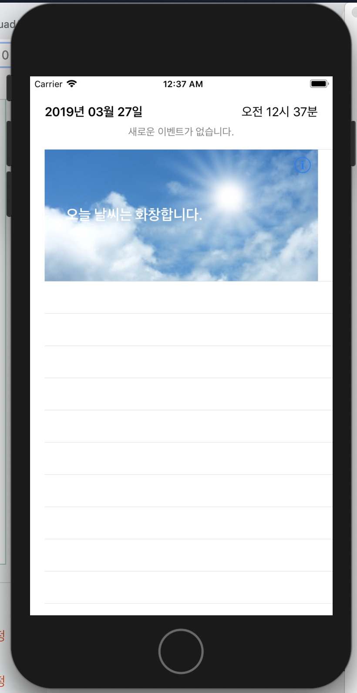


### Step 2

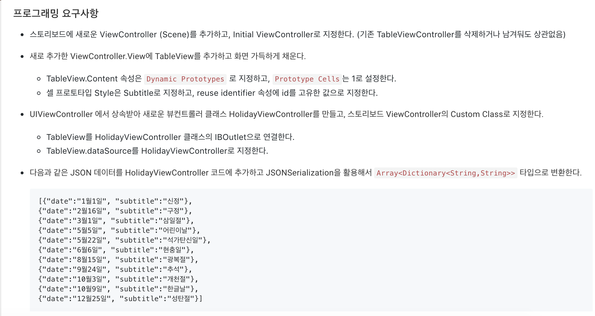

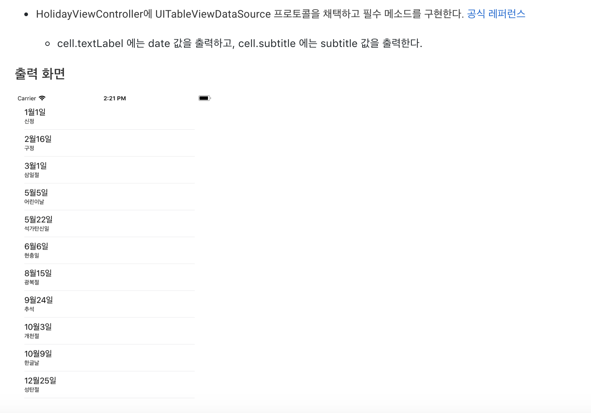

* `UITableView` 의 `Dynamic` Content를 이용하여 TableView를 디자인한다.
* `JSONSerialization` 을 활용하여 JSON 데이터를 SWIFT 데이터 형식으로 변환한다.


**TableView Dynamic**

 이전 단계에서 Static Cells로 Cell들을 미리 만들어 놓았던 것과 다르게 Dynamic에서는 `ReuseQueue`를 활용하여 필요할 경우에만 Cell을 생성하여 쓰고 아닌 경우에는 `ReuseQueue` 에서 꺼내쓴다. 

 이렇게 동작하기 위해 세팅해줘야하는 몇가지 사항들이 있다.


1. 스토리보드에 UITableViewController가 아닌 UIViewController를 생성해준다.

2. UIViewController에 화면에 꽉차게 UITableView를 생성해준다.
3. `UITableView`를 `IBOutlet`으로 연결해준다.

```swift
class ViewController: UIViewController {
  @IBOutlet weak var tableView: UITableView!
}
```

4. ViewController 객체를 `UITableView` `DataSource` 로 등록해준다. 그러기 위해서 ViewController가 `UITableViewDataSource`프로토콜을 채택하여야 한다.

```swift
class ViewController: UIViewController {
  @IBOutlet weak var tableView: UITableView!
  
  override func viewDidLoad() {
    super.viewDidLoad()
    tableView.register(UITableViewCell(), forCellReuseIdentifier: "reuseQueue")
  }
}

extension ViewController: UITableViewDataSource {
  // 테이블 뷰의 섹션수를 리턴
  func numberOfSections(in tableView: UITableView) -> Int {
        return 1
    }
  
  // 한 섹션당 들어갈 로우의 수를 정해준다
  func tableView(_ tableView: UITableView, numberOfRowsInSection section: Int) -> Int {
    return 3
  }
    
  // 셀을 큐에서 필요할 경우 가져오고 없을 경우 새로 생성해준다. 그 후 셀을 설정한 후 테이블 뷰에 리턴
  // **큐의 identifier가 꼭 필요하다**
  func tableView(_ tableView: UITableView, cellForRowAt indexPath: IndexPath) -> UITableViewCell {
    let cell = tableView.dequeueReusableCell(withIdentifier: "reuseQueue", for: indexPath)
    // 이렇게 큐에서 셀을 빼올 경우는 꼭 tableView에 cell을 등록해주어야 한다.

    cell.textLabel?.text = "\(indexPath.section), \(indexPath.row)"
    return cell
  }
}
```

 만약 register를 등록하지 않고 사용할 경우 밑과 같이 해주면 된다.

```swift
// 이렇게 등록할 경우 Cell의 스타일을 정할 수 있다.
let cell: UITableViewCell
if let reuseCell = tableView.dequeueReusableCell(withIdentifier: "reuseQueue") {
  cell = reuseCell 
} else {
  cell = UITableViewCell(style: .subtitle, reuseIdentifier: "reuseQueue") 
}
```


5. `DataSource`를 `TableView`에 연결시켜준다.

```swift
class ViewController: UIViewController {
  @IBOutlet weak var tableView: UITableView!
  
  override func viewDidLoad() {
    super.viewDidLoad()
    tableView.dataSource = self
  }
}

extension ViewController: UITableViewDataSource { }

```


**JSON Serialization**

 JSON 데이터를 파싱할 수 있는 방법들이 있지만 이번 스텝에서는 JSONSerialization 객체를 이용해보았다.

```swift
let json = """
                    [{\"date\":\"1월1일\", \"subtitle\":\"신정\"},
                    {\"date\":\"2월16일\", \"subtitle\":\"구정\"},
                    {\"date\":\"3월1일\", \"subtitle\":\"삼일절\"},
                    {\"date\":\"5월5일\", \"subtitle\":\"어린이날\"},
                    {\"date\":\"5월22일\", \"subtitle\":\"석가탄신일\"},
                    {\"date\":\"6월6일\", \"subtitle\":\"현충일\"},
                    {\"date\":\"8월15일\", \"subtitle\":\"광복절\"},
                    {\"date\":\"9월24일\", \"subtitle\":\"추석\"},
                    {\"date\":\"10월3일\", \"subtitle\":\"개천절\"},
                    {\"date\":\"10월9일\", \"subtitle\":\"한글날\"},
                    {\"date\":\"12월25일\", \"subtitle\":\"성탄절\"}]
                    """
        
let jsonData: Data? = json.data(using: .utf8)
guard let data = jsonData else { return }
guard let convertedData = try? JSONSerialization.jsonObject(with: data, options: []) as? [Dictionary<String, String>] else { return }
```


**실행화면**

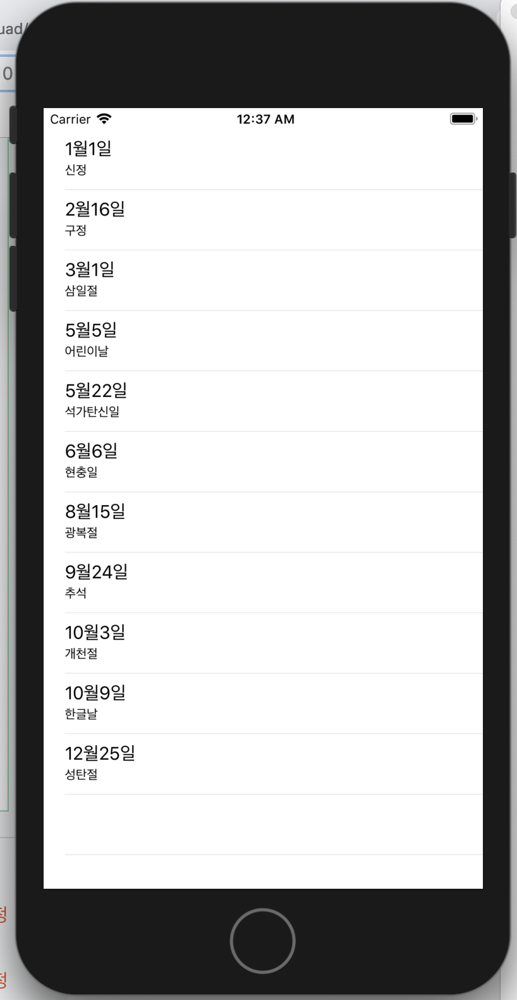


### Step 3

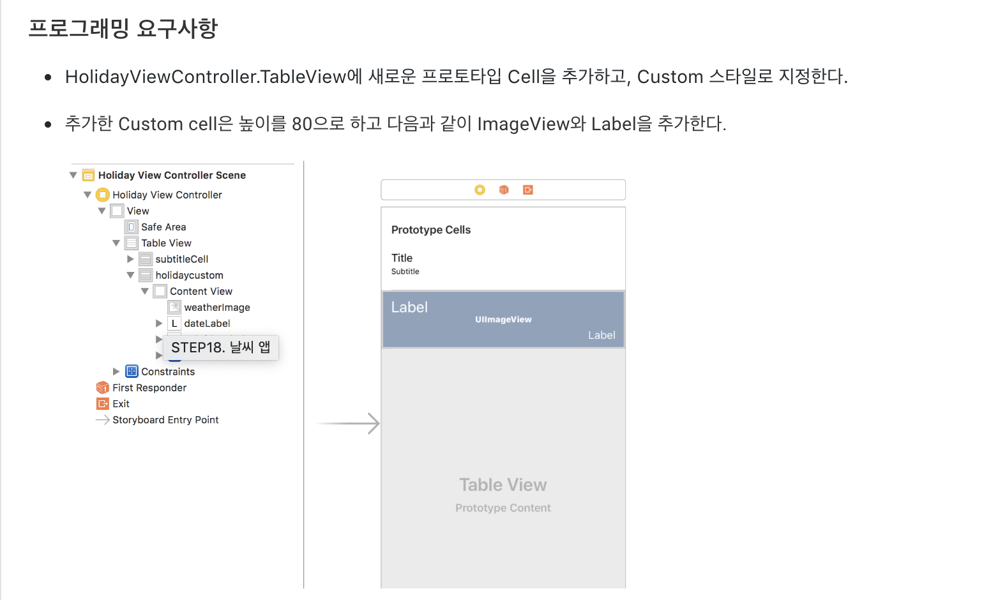

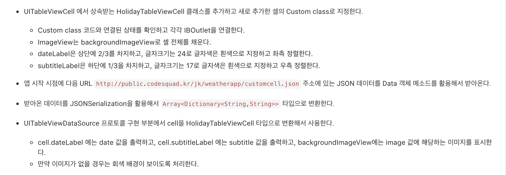

* Custom Cell을 만들어서 디자인한다.
* Info.plist에서 http접근을 허용하고 URL로부터 text를 읽어온다.
* Cell의 높이를 지정하는 방법을 안다.


**Custom Cell 만들기**

1. MainStoryBoard에 TableView를 생성한다.
2. TableView에 Cell을 하나 추가하고 Cell Style을 Custom으로 지정해준다.
3. Cell의 `identifier` 을 꼭 지정하고 기억한다.
4. StoryBoard CustomCell의 Component들을 추가해 디자인한다.

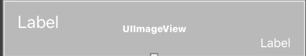

5. CustomViewCell Class를 하나 생성 후 `IBOutlet` 요소들을 추가한다.

```swift
class HolidayTableViewCell: UITableViewCell {
    @IBOutlet weak var dateLabel: UILabel!
    @IBOutlet weak var weatherImage: UIImageView!
    @IBOutlet weak var subtitleLabel: UILabel!
    
    override func awakeFromNib() {
        super.awakeFromNib()
        // Initialization code
    }

    override func setSelected(_ selected: Bool, animated: Bool) {
        super.setSelected(selected, animated: animated)
        // Configure the view for the selected state
    }
}
```

6. tableView에 `TableViewDataSource` 을 채택한 객체를 등록해준다.

```swift
class HolidayViewController: UIViewController {
  @IBOutlet weak var tableView: UITableView!
  
  override func viewDidLoad() {
    super.viewDidLoad()
    tableView.dataSouce = self
  }
}

extension HolidayViewController: UITableViewDataSource {
}
```

7. DataSource의 채택에 필요한 메소드들을 구현한다.

```swift
func numberOfSections(in tableView: UITableView) -> Int {
        return 1
}

func tableView(_ tableView: UITableView, numberOfRowsInSection section: Int) -> Int {
  return dateEventInformation.count
}
    
// 여기서 Identifier에 아까 Cell생성 시 등록했던 Identifier를 적어준다.
func tableView(_ tableView: UITableView, cellForRowAt indexPath: IndexPath) -> UITableViewCell {
  let cell = tableView.dequeueReusableCell(withIdentifier: "reuseQueue", for: indexPath) as! HolidayTableViewCell
  cell.dateLabel.text = "2015/10/25"
  cell.subtitleLabel.text = "한글날"
  cell.weatherImage.image = UIImage(name: "sunny")
  return cell
}
```


**Cell의 높이 지정해주기**

 Cell의 높이를 지정해주기위해 2가지 방법이 있다. 

1. 내용에 상관없이 고정으로 지정
2. 내용에 따라 Cell의 높이가 Dynamic하게 바뀐다.


 첫번째 방법

 높이를 지정해주기 위해 UIViewDelegate를 채택한 클래스를 delegate로 tableView에 등록해주어야 한다. 그리고 다음과 같은 메소드를 구현한다.

```swift
class HolidayViewController: UIViewController {
  @IBOutlet weak var tableView: UITableView!
  
  override func viewDidLoad() {
    super.viewDidLoad()
    tableView.delegate = self
  }
}

extension HolidayViewController: UITableViewDelegate {
  // indexPath에 따라 Cell의 높이를 다르게 지정해줄 수 있다.
  // 다음과 같이할 경우 모든 Cell의 높이가 80으로 고정된다.
  func tableView(_ tableView: UITableView, heightForRowAt indexPath: IndexPath) -> CGFloat {
        return 80
    }
}
```


 두번째 방법

 콘텐츠 내용에 따라 유동적으로 지정해줄 수 있다. 최소 Cell의 높이를 지정한 다음 콘텐츠의 양이 많아지면 Cell의 높이가 높아지도록 지정하는 방법이다.

```swift
class HolidayViewController: UIViewController {
  @IBOutlet weak var tableView: UITableView!
  
  override func viewDidLoad() {
    super.viewDidLoad()
    tableView.rowHeight = UITableView.AutomaticDimension // 콘텐츠 크기에 따라 맞추겠다는 의미이다.
    tableView.estimatedRowHeight = 100   // 기본 초기값을 설정해준다. 개발자가 대략 생각하는 Height를 넣음
    tableView.delegate = self
  }
}

extension HolidayViewController: UITableViewDelegate {
func tableView(_ tableView: UITableView, estimatedHeight indexPath: IndexPath) -> CGFloat) {
  return UITableView.AutomaticDimension
}
```


**URL 접속 앱 권한 허용 info.plist 수정**

 처음 URL을 통해 text를 받아올 때, 계속 코드가 맞는데 실행이 되지 않았다. https로 부터 정보를 읽어올 수 없다는 오류가 계속 발생하였다. 앱에서 권한이 얻어지지 않아서 앱자체에서 거부를 하고 있었다. 이를 해결하기 위해 Info.plist의 설정을 바꾸어 주었다.

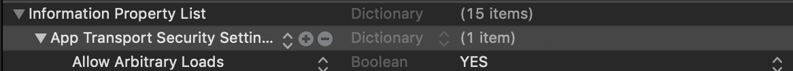

 https로 부터 정보를 읽어오기 위해 다음과 같은 설정을 바꾸어준다.


**실행화면**

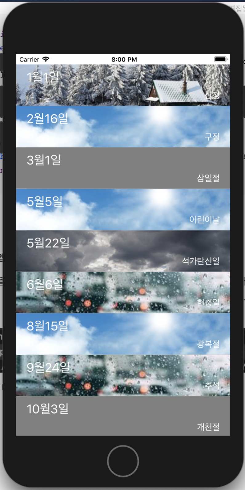


