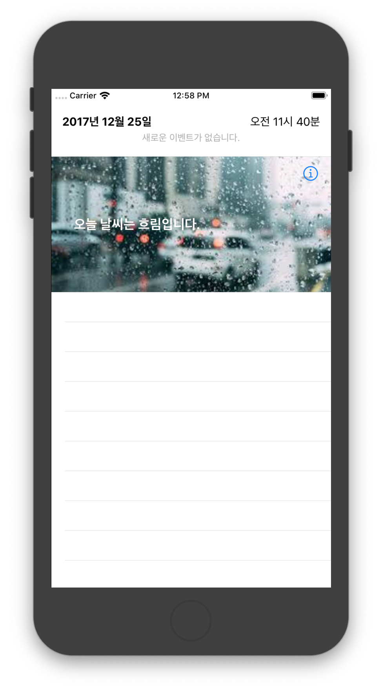
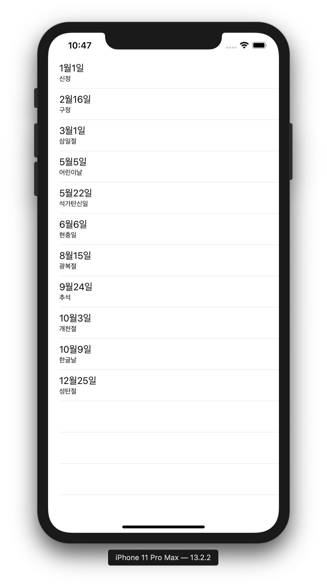
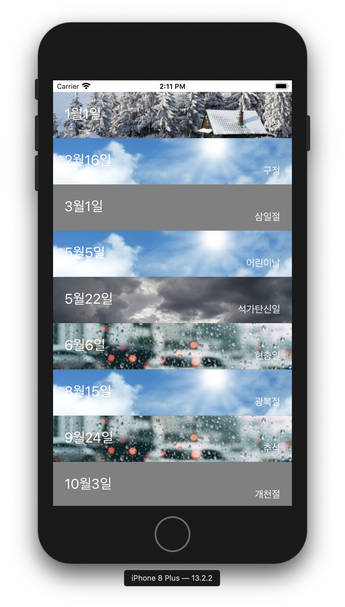

# swift-weatherapp
STEP18 날씨 앱 저장소


## 18-1 : UITableViewController

### 화면 이미지


### 핵심 기능

- TableViewController 속성에서 Content 값을 Static Cells로 변경
- 가이드라인에 맞춰서 만듬

### 학습 내용
- Static한 TableView는 TableViewController를 이용하는 경우에만 만들 수 있다. ( 정적 테이블을 사용하기 위해서는 UITableView가 아닌 UITableViewController 안에서 사용해야 한다.)
- TableView 오브젝트를 선택한 뒤, Static Cells를 선택

- 이미지 채우는 contentMode에 대해 학습: [블로그 정리](https://roeldowney.tistory.com/153)

## 어려웠던 점

- DateTimeCell 설정에서 dateLabel, timeLabel 이등분으로 설정할때 set horizontal hugging priority to 200 에러가 났다.

이게 왜 에러가 난지 모르겠다. 일단 이등분으로 하기위해 두개의 Label을 선택하고 width를 동일하게 주었다.


- Failed to instantiate the default view controller for UIMainStoryboardFile 'Main' - perhaps the designated entry point is not set?

: 위의 에러가 난 이유는 처음 스토리보드에서 만들어진 걸 지우고 새로 Table View Controller를 올리고 View Controller에 is Initial View Controller 를 체크가 해제 되어서 에러가 났다.


## 18-2 : DataSource 객체

### 화면 이미지



### 핵심 기능

- JSONSerialization을 활용
- UITableViewDataSource 프로토콜 채택하고 필수 메소드 구현

### 학습 내용

- UITableViewController와 UIViewController에 UITableView를 추가한 차이를 학습
- DataSource 프로토콜을 구현하기 위한 필수 메소드 형식과 동작 방식을 정리
- Delegate 패턴과 DataSource 프로토콜과 비슷한 점, 차이점은 무엇인지 학습

## 어려웠던 점

- JSONSerialization를 활용해서 Holidays를 만들었는데, UITableViewDataSource 추가하는 과정에서 dequeueReusableCell를 제대로 쓸 줄 몰라서 어려웠다.

- tableView.dequeueReusableCell(withIdentifier: "idCell", for: indexPath) 이 부분에서 "idCell" 이건 하드코딩을 하기 보다는 코드로 표현하는게 좋다고 피드백 받았다. cell 별로 고유한 id 이니깐 Custom Cell 클래스가 있다면 내부로 옮기는게 좋다.
- 데이터 구조를 만들때 분리해서 생각하지 못했다.  
  - holidays 내부에 Holiday 를 표현하는 데이터 구조를 만드는 걸 권장합니다. 최소 데이터 구조 `Holiday`와 그걸 포함하는 콜랙션 `[Holidays]`, 전체 기능을 다루는 `Holidays` 등을 분리해서 생각하세요.
  - Holiday 자체를 표현하는 데이터 구조를 만들어서 `holiday["date"]` 보다는 `holiday.date` 로 접근하는 게 안전합니다.


## 18-3 : 커스텀 셀

### 화면 이미지



### 핵심 기능

- HolidayViewController.TableView에 새로운 프로토타입 Cell을 추가하고, Custom 스타일 지정
- URL주소에 있는 JSON 데이터 받아온다. (URLSession 객체를 사용하지않는다.)
- 이미지가 없을 경우는 회색 배경이 보이도록 처리

### 학습 내용

- 테이블뷰 Custom 셀을 만들고, 테이블뷰를 채우는 방법을 학습
- 테이블뷰에서 자동으로 결정하는게 아니라 강제로 셀 높이를 지정하는 방법에 대해 학습한다.

## 어려웠던 점

- http로 정보를 읽어오기 위해서 설정을 추가 해줘야한다는것 

  App 보안성을 위해 ATS(App Trasport Secuirty) 라는 정책을 통해 기본적으로 https 통신을 하도록 유도하고 있다. 

  (해결방법 블로그 정리) : https://roeldowney.tistory.com/157

- Cell의 크기가 80이 안되는것 같아서 어떻게 해결해 줄까? 고민을 많이 했다. 

  HolidayViewController의 viewDidLoad 에 아래와 같이 작성하면 된다.

```swift
override func viewDidLoad() {
        super.viewDidLoad()
        holidayTable.rowHeight = 80.0
}
```

- HolidayTableViewCell 재사용으로 Image가 없는 화면에 회색 backgroundColor가 아니라 Image가 출력이 되었다. 이걸 해결하기 위해서 아래 코드를 설정 해 주었다.

```swift
override func prepareForReuse() {
        super.prepareForReuse()
        dateLable.text = nil
        sibtitleLabel.text = nil
        weatherImage.image = nil
    }
```


