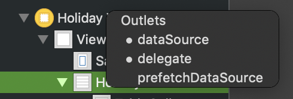
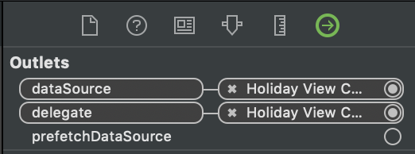

## 1) UITableViewController와 UIViewController에 UITableView를 추가한 차이

- TableView의 Content를 Static Cell로 변환하면 다음과 같은 에러 메시지가 뜹니다.

  > Main.storyboard: error: Illegal Configuration: Static table views are only valid when embedded in UITableViewController instances

- 위 에러는 해당 뷰 컨트롤러를 애초에 UITableViewController로 만들면 사라지는 오류입니다.


### UITableViewController

`UITableViewController`는 `UIViewController` 를 상속받은 특별한 형태의 서브클래스로, 

view는 UITableView이고, **constraints를 변경할 수 없습니다.** `UITableView` 에 cell의 형태가 아닌 방식으로는 view를 추가할 수 없습니다.


##### Advantage : UITableViewController 장점

- `contentOffset` 이 현재의 active text field에 맞게 자동으로 움직입니다.

  - 예시

    

    ​																[이미지 출처](https://www.codementor.io/nguyentruongky33/uitableviewcontroller-vs-uiviewcontroller-uitableview-rfxuec34w)

- 채팅 로그화면이나 form 화면에 적합합니다

- `static table view` 사용이 가능합니다. 즉, Content = `Static Cell` 모드가 허용됩니다.

​													

##### DisAdvantage : UITableViewController 단점

- 뷰를 추가하여 `상태 뷰` 를 나타낼 수 없습니다. 테이블 헤더뷰(tableHeaderView)나 테이블 푸터뷰(tableFooterView)를 추가하여 비슷한 방식으로 표현할 수 있지만, 더 많은 일을 수행해야 합니다.
- 일반적인 컨트롤러를 상속받을 수 없습니다. 
  - 즉, 상태뷰, 로드할 데이터, UI 셋업 등의 많은 기능을 갖고 있는 기본 컨트롤러는 **UIViewController와 달리** **테이블뷰의 상속대상이 되지 못합니다.** 
- 고정된 top 혹은 bottom view를 추가할 수 없습니다.


-----


### UIViewController + UITableView

- UITableView의 constraints를 개발자가 마음대로 설정할 수 있습니다.


##### Advantage : UIViewController + UITableView 장점

- 매우 유연합니다.
- 테이블 뷰에 패딩을 설정하거나, 테이블뷰를 보이고/감추는 것이 가능합니다.
- 상태(State) 표현에 유용합니다.


​																	[이미지 출처](https://www.codementor.io/nguyentruongky33/uitableviewcontroller-vs-uiviewcontroller-uitableview-rfxuec34w)

##### DisAdvantage : UIViewController + UITableView 단점

- static table view 는 허용되지 않습니다.

- contentOffset이 현재 활성 텍스트 필드에 맞게 자동으로 움직이지는 않습니다.

  - 예시 

    

    ​															[이미지 출처](https://www.codementor.io/nguyentruongky33/uitableviewcontroller-vs-uiviewcontroller-uitableview-rfxuec34w)

    


----

----


## 2) DataSource protocol Implementation

- TableView의 Cell에 데이터를 바인딩 하기 위해 DataSource(여기서는 `UITableViewDataSource`) 프로토콜을 채택하며 구현해야할 메서드는 아래의 두 가지 입니다.

  ```swift
  //하나의 섹션에 설정할 row의 개수를 설정하는 메서드
  func tableView(_ tableView: UITableView, numberOfRowsInSection section: Int) -> Int
  //row에 들어갈 Cell의 데이터를 초기화 하는 메서드
  func tableView(_ tableView: UITableView, cellForRowAt indexPath: IndexPath) -> UITableViewCell
  ```

  - 두번째 메서드를 사용할 때, 앱의 퍼포먼스를 향상시키기 위해서는 재사용가능한 셀을 활용하는 방식이 좋습니다.
  - 커스텀 셀을 지정하고, `tableView.dequeueReusableCell(withIdentifier: "CustomCell의 RestorationID")` 값을 입력하여 큐에서 추출한 후, 해당 커스텀 클래스로 타입캐스팅을 해주는 작업을 합니다.
  - 주의해야 할 점은 **기존의 셀 작업에서 설정한 값들(배경 색 등)이 남아있을 수 있기 때문에** 이를 적절히 clear시켜주는 동작을 취해줘야 합니다.

  

- 여기에 하나 더 추가하여 테이블에 섹션을 몇개를 둘 것인가에 대한 설정도 가능합니다.

  ```swift
  func numberOfSections(in tableView: UITableView) -> Int
  ```

- 각 섹션별로 타이틀을 정해주는 설정도 가능합니다.

  ```swift
  func tableView(_ tableView: UITableView, sectionForSectionIndexTitle title: String, at index: Int) -> Int {
  }
  ```


- 실제 코드 예제입니다. DataSource에 대한 준수 메서드임을 나타내기 위해 별도의 extension으로 표현하였습니다.

  ```swift
  extension HolidayViewController: UITableViewDataSource {
      func tableView(_ tableView: UITableView, numberOfRowsInSection section: Int) -> Int {
          return holidayInfoDictionaryArray.count
      }
      
      func tableView(_ tableView: UITableView, cellForRowAt indexPath: IndexPath) -> UITableViewCell {
          guard let cell  = tableView.dequeueReusableCell(withIdentifier: "TableCell") as? TableCell else {
              return TableCell()
          }
          guard let title = holidayInfoDictionaryArray[indexPath.row][titleKey],
        			let subtitle = holidayInfoDictionaryArray[indexPath.row][subtitleKey] else {
             		 return cell
        		  }
          cell.title.text = title
          cell.subtitle.text = subtitle
          return cell
      }
  }
  
  class TableCell: UITableViewCell {
      @IBOutlet weak var title: UILabel!
      @IBOutlet weak var subtitle: UILabel!
  }
  
  ```

  

## 3) Delegate Pattern and DataSource protocol

- 객체 지향에서 딜리게이트 패턴은 한 객체가 모든 일을 수행하는 것이 아니라, 일부의 일을 다른 객체(delegate object)에게 위임하는 패턴입니다.
- iOS에서는 **`프로토콜` 을 사용**하여 이러한 delegate 패턴을 구현합니다.

- Delegating  클래스는 하나의 outlet 또는 프로퍼티를 지니고 있는데, 보통 이 것의 이름은 `delegate` 입니다.  


- Delegate를 지정하는 방식은 2가지 방식이 있는데, **storyboard를 활용하는 방법**과 코드레벨에서 delegate를 설정하는 방식입니다.

- 우선 **storyboard**를 활용할 때는 테이블 뷰에서 현재의 커스텀 뷰 컨트롤러로 `ctrl + 드래그` 시에 delegate나 DataSource를 바인딩 할 수 있습니다. 이렇게 바인딩 한 경우, 커스텀 뷰 컨트롤러가 `UITableViewDataSource` 프로토콜의 구현사항을 대신 작동시키는 방식으로 딜리게이트 패턴이 작동합니다.

  

  

- 다른 한 가지 방식은 **코드레벨**에서 해당 IBOutlet (`tableView`) 의 delegate를 설정하는 방식으로, 커스텀 뷰 컨트롤러에 UITableViewDataSource를 채택한 경우, viewDidLoad() 메서드 호출시에 아래와 같이 `딜리게이트`로 `커스텀 뷰 컨트롤러 자기자신`을 설정하면 됩니다. 

  ```swift
  class HolidayViewController: UIViewController, UITableViewDataSource {
      @IBOutlet weak var holidayTableView: UITableView! 	//Delegating class
          override func viewDidLoad() {
              super.viewDidLoad()
              self.holidayTableView.delegate = self 
              initiateHolidayInformation()
      }
    //...
  }
  ```

- self.holidayTableView.delegate = self  

  - tableView가 수행할 위임의 대상자가 현재의 ViewController 라는 것을 의미합니다.

- 이렇게 딜리게이트를 설정하고 나면, **DataSource 프로토콜을 채택하는 뷰 컨트롤**러는 **tableView와 관련된 여러 메서드를 호출하게 되는데**, 이 때 내부적으로는 해당 tableView가 직접 일을 도맡아서 처리하는 딜리게이트 패턴이 구현됩니다.

- 실제 테이블을 채우는 행위를 뷰 컨트롤러의 메서드(파라미터로 delegate로 지정된 tableView를 받습니다.) 를 통해 실질적으로는 holidayTableView가 수행하는 방식이 됩니다.


### 요약 

공통점 : iOS의 DataSource 역시 디자인패턴의 Delegate pattern의 활용 예이다.

차이 : iOS Delegate/DataSource는 **Protocol의 형태로 딜리게이트 패턴을 구현**

- 프로토콜을 사용하는 경우, Delegate 대상을 명확하게 지정할 수 있고, 누락의 위험도 적다.
- 공통적인 기능을 확실한 방법으로 구현할 수 있다. (혼선 가능성 낮음)
- 해당 뷰 컨트롤러에서 반드시 구현해야 할 메서드 명시 가능. (일부 프로토콜 메서드는 기본 구현 지원)
- 한 화면에서 여러 컴포넌트가 delegate로 지정될 경우, 이를 알맞게 해당 컴포넌트에게 위임할지 분명해진다.


### 참고 사이트

https://developer.apple.com/documentation/uikit/uitableviewcontroller

https://developer.apple.com/library/archive/documentation/General/Conceptual/CocoaEncyclopedia/DelegatesandDataSources/DelegatesandDataSources.html

https://magi82.github.io/ios-delegate/

https://www.codementor.io/nguyentruongky33/uitableviewcontroller-vs-uiviewcontroller-uitableview-rfxuec34w

https://learnappmaking.com/table-view-controller-uitableviewcontroller-how-to/#how-it-works

